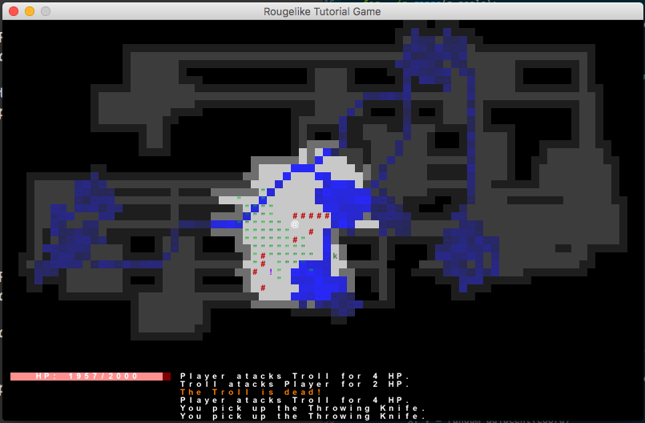

# A Basic Roguelike

This is a basic roguelike game implemented in python using the [tdl](https://python-tdl.readthedocs.io/en/latest/) library.



I was originally following the [rougelike tutorial revised](http://rogueliketutorials.com/), but have gone far off the path laid out there.

## How to Install

You'll need a working Python 3 installation to play.

Install the `tdl` library:

```
pip install tdl
```

and then start the game with

```
python roguelike.py
```

## Controls

  - `hjkl` moves horizontally and vertically.  You can also use the arrow keys.
  - `yubn` moves diagonally.
  - `z` passes a turn.
  - `i` opens the inventory.
  - `d` opens the inventory for dropping items.
  - `t` opens the inventory for throwing items.
  - `e` opens the inventory for equipping items.
  - `g` picks up an item.
  - `esc` quits a menu or the game.
  - `alt + enter` enters full screen mode.

## Things in the Dungeon

  - You are the `@` sign.
  - Letters represent monsters, watch out!
  - `!`'s are potions.  You can use them on yourself or throw them at enemies.
  - `%`'s are scrolls.  You can use them to cast spells.
  - `↑`'s are throwing knives.  You can throw them at any target.
  - `&`'s are armor.  Make sure to equip it!
